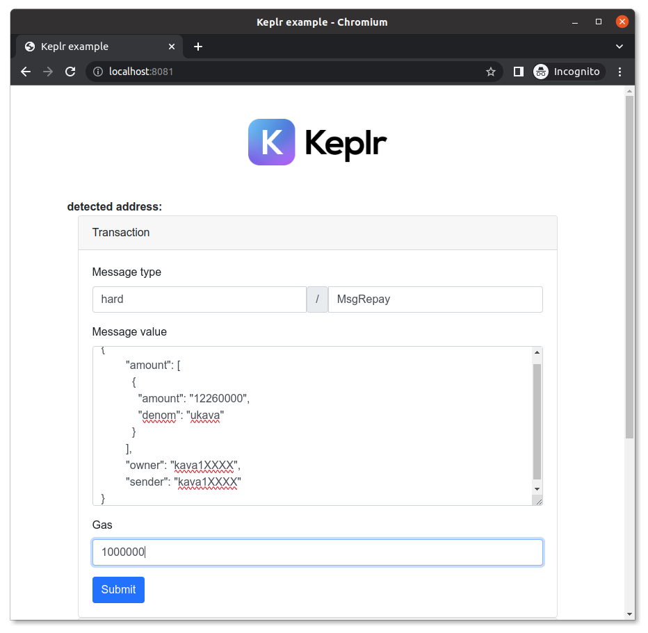

# Keplr Fee Overrider
Web form to send transactions through the Keplr extension. It adds a fee override for cheaper transacting. Focused on Kava, but should work on other networks.



## Requirements
* [Keplr extension](https://github.com/chainapsis/keplr-wallet/) installed in your browser
* NodeJS with NPM
* a git clone or downloaded copy of this repo

## Local deployment
Install dependencies
```
npm install
```

Run the development server
```
npm run dev
```

Navigate to http://localhost:8081/

## Usage: simple send
On the `Simple Send` form, fill the intended Recipient, Memo and Amount to send. Click on the `Submit` button; Keplr should popup. Approve the transaction on Keplr **without** touching the fee controls. The transaction will broadcast upon approval.

You can adjust the gas limit and fee rate by editing them on the `src/main.js` file.

## Usage: transaction
For other transactions, use the `Transaction` form. Input the *message type*, the JSON formatted payload, and the gas limit.

A simple way to find out what should those be consists in preparing to transact on the web interface, e.g., one of the many functions offered on https://app.kava.io/. When the Keplr popup opens to sign the transaction, it should display the *message type* on the *Details* tab, the *payload* on the *Data tab*, and the *gas limit* on the *Advanced* tab. Copy those fields to the form, and then click cancel on the Keplr popup.

Click on the `Submit` button; Keplr should popup. Approve the transaction on Keplr **without** touching the fee controls. The transaction will broadcast upon approval.


